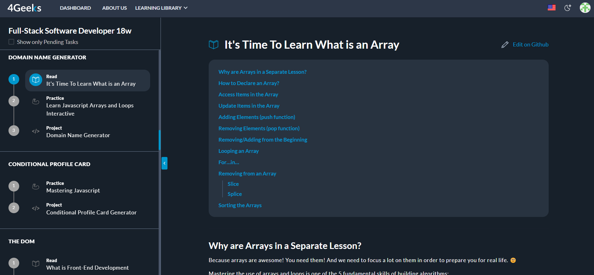

# Course Structure

Our courses are followed by a well-organized framework that combines interactive lessons, hands-on projects, and personalized support. It doesn't matter if you are a beginner or already have some knowledge in the field. We assure you that we will make it as simple and entertaining as possible.
How will we do that?? you may be wondering... Well, don't worry! In this article, we will briefly explain how our system works.

Whether you choose one of our bootcamps or short courses, we have worked based on our ***[special formula](https://4geeksacademy.notion.site/4geeksacademy/Mastering-Technical-Knowledge-984d2df394c44aedb05987311ccfcf06)*** in order to guarantee an exponential learning curve 📈. You will see that it will be entertaining for you and you will learn things all the time without even realizing it! 

So, let's show you what you will find along this journey 😎

## Basic structure 

The first thing that you need to know is that our courses are divided into modules, making it super easy for you to navigate through the material. Once you're all set and click that blue "start course" button, you'll be away to the next screen:

Up at the top of your screen, you'll find some really helpful information. It'll show you the percentage of progress you've made in the program, how many tasks you've already completed, and how many more exciting tasks you have ahead. It's like your personal progress tracker!

### Our Moduls

As you scroll down you will unlock new modules! At 4geeks, we're all about breaking free from monotony because who wants more of the same, right? That's why we've created diverse and exciting modules, packed with a wide range of challenges. Each module comes with its own unique flair and duration, and guess what? Every single one of them will equip you with awesome new skills to become a rockstar programmer.

Here is an example of a module from one of our bootcamps:

### 🤔 What do our modules contain?

When you start each module, the first thing you will find are the 📖 ***Reading Lessons***. These will provide detailed explanations about specific topics before you start putting them into practice. You can see them as the columns of a building, forming a solid foundation for your learning journey. 

These lessons are carefully curated to provide you with additional insights, real-life examples, and different perspectives on the subject. Reading them carefully is crucial because they give you the knowledge you need to succeed. So, take your time, grab a cup of coffee, and get ready to absorb the information!.

So, once you have understood a subject (theoretically), you are ready to put your knowledge into practice through the 💻 ***Intective Exercises***. They are like short challenges that will increase in difficulty so that in the end you can master the whole subject. These have an automatic evaluation mode along the way that tells you if you are doing it right or if there is a mistake in your code. They also have video tutorials in case you get stuck at some point, so don't worry! Although, we recommend that you try to solve it first on your own, to develop critical thinking.

### 🌱 Projects:

Think of them as big challenges rather than short tasks. Projects come with complete instructions, from opening the project repository to step-by-step details on what needs to be done. It's like having a roadmap to successfully complete them!.

These projects provide an opportunity for students to put their newly acquired skills into practice and work on practical scenarios. You get to collaborate with classmates, solve coding challenges, and build impressive portfolio-worthy projects. It's an exciting way to learn by doing and gaining experience that will prepare yourself to be a great future programmer.

### ⌛ Quizzes: 

During the course you will find quizzes lined up to test how much attention you've been paying so far. These quizzes are a series of multiple-choice questions, and they're super quick and enjoyable. No excuses, they won't take up much of your time! While they're not mandatory, we highly recommend giving them a shot. It's a great way to exercise your mind and see just how much you've learned along the way. 

###  🏋️ Pre-work:

The prework sets the foundation for your learning journey. You'll be introduced to key concepts, basic terminology, and handy resources to kickstart your learning adventure. It's like a warm-up before the main event (the actual course)! The prework helps you get familiar with the course material, ensuring you're ready to hit the ground running. Trust us, investing some time in the prework pays off big time. 