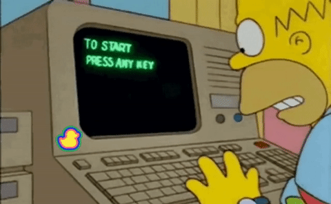

#  Participating in Workshops

Let's talk about our [Workshops](https://4geeks.com/lesson/live-events-workshops-and-classes#4geekscom-live-events-workshops-classes)! They're like a whole new way to learn directly from the coolest and most pro experts out there! In programming, the theory is like learning to walk before we run! It's essential to understand the foundational concepts and principles that make up coding. But let's be real – the real fun begins when we get to run! That's when the magic happens. 

So, here's the catch: workshops are all about getting hands-on and putting that theory into action! You'll have the chance to see these pros live in action, doing what they do best – working on projects and tackling challenges like a piece of cake! 
If you're ready to take your skills to the next level and see how the pros do it, these workshops are where it's at! We've got some cool stuff waiting for you 😎

## How to Get the Best Out of It?

When attending a workshop, there are some important things to keep in mind. In this article, we'll share some of these tips with you, so you can make the most out of your workshop experience! 

### 1) Do Some Research 🔍
Make sure to do some research before joining them! In these workshops, we're diving straight into the running part. So, it's a good idea to check out what topics they'll cover beforehand. When the projects start rolling, you'll feel more prepared and won't get lost along the way. Knowing what to expect will boost your confidence and make the experience even more enjoyable.

### 2) Ask Questions 🤔
Don't hesitate to ask questions during these sessions! These workshops are designed for your learning, to help you understand, clarify, and put new things into practice. So, if anything is unclear or confusing, speak up and ask those questions. We're all here to support each other and become better programmers together. No doubts should be left behind!

### 3) Take Notes 📝
In the workshops, the pros will share lots of tips and make important comments. You'll learn a ton from them! So, it's a good idea to have a pencil and paper handy. Write down anything you find important. This way, you'll remember the info better and have a helpful reference when you practice coding on your own. It's like having a secret weapon that will help you whenever you need it.

### 4) Hands-On Practice 💪
After the workshops, don't forget to practice what you've learned on your own. It's super important to reinforce all that newfound knowledge through hands-on practice. Trust me, doing it right away is way easier than putting it off for later. Small details can slip from our memory, and we don't want that, because they can make a big difference in your coding journey. So, let's keep that momentum going and make sure those skills stick like glue! 

### 5) Networking 🌐
Let's talk about networking, it's a fantastic way to boost your learning experience! Try connecting with people in the workshop, who share the same interests and learning goals as you. You'll get to share ideas, learn from different perspectives, and grow together. It's a super cool way to expand your knowledge and make new coding mates.

### 6) You've Got This 🔥
Trust yourself! We're all here to learn together. So, don't ever fear making mistakes or asking what you might think is a "silly question." There's no judgment here, seriously! The most important thing is to have confidence in yourself and your abilities. Trust in what you do, and believe in yourself, that is the key to true success.

We know you're going to love our workshops! They're packed with so much amazing stuff to learn! And you know what they say... to be the best, you gotta learn from the best. And that's exactly what you'll get here!
