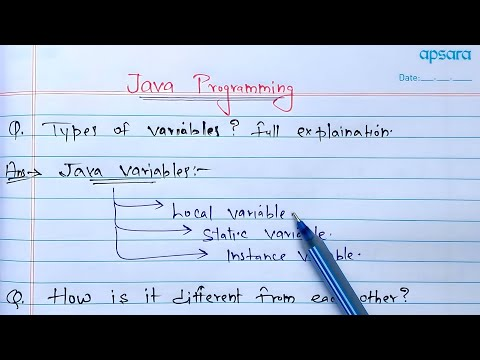

# Preparing for a Session

Before we dive into the [Mentoring Sessions](), there are a few things you should totally keep in mind. Don't worry, it won't take long to go through them, but they'll definitely save you time and make your whole experience way smoother.

In this article, we'll share some tips on how you can make the most out of your time with the mentors and supercharge your learning experience. Are you ready to level up your skills?!

## Before a Session

This is perhaps the most important part. Before your session, take some time to organize all your thoughts and ideas. It's crucial that when you start, you're clear about the things you don't understand or the areas where you're feeling stuck. This way, you can make the most of your session and get the help you need. To achieve this, we will give you some tips that can help you in the process:

1. **Organize Your Thoughts** 💭: If you ever come across something you don't understand while practicing or reading concepts, don't just brush it off for later. Let's make sure those doubts don't slip away! Grab a pencil and paper, and write down those questions as soon as they pop up. That way, you can bring them up during your session and get them all answered.

2. **See if you are really stuck** 🤔: Hey, we all go through those moments when practicing, and it's completely normal to feel frustrated and ask for help. But here's a little secret, you are way more capable than you think! Sometimes, we doubt ourselves, but the truth is, you've got the skills to handle it. So, whenever you feel stuck, take a moment and trust yourself. Give it a shot and see if you can find a solution on your own. Trust me, you will be surprised. 

3. **Review Previous Material** 📖: It's a good idea to take a look at any coding exercises or projects you've done before. Just a quick review. This will help jog your memory and also show you areas where you might need some extra help or guidance. It's like a little warm-up before the session.

4. **Check Your Equipment** 💻: Make sure your computer, internet connection, and any necessary software are working smoothly. Being well-prepared technically will save time during the session.

## During a Session 

Once you're in the mentoring session, you're already halfway there! These sessions are all about YOU. They're super personal, so don't hesitate to ask any and all the questions that pop into your mind. Seriously, feel free to ask anything you're not sure about.

1. **Be Curious** 💡:  It's totally normal that when we are clarifying doubts on a specific topic, other related questions pop up in your mind. So, feel free to share those questions with your mentor. Don't let any lingering doubts weigh you down; we are here to clarify all of them, so you can have a smooth learning experience! Remember, there's no limit to what you can ask, so let those questions flow!

2. **Take notes** 📝: Taking notes is key when you're clarifying doubts or learning new procedures with your mentor. We know sometimes everything seems crystal clear at the moment, but later, you might forget some crucial details when tackling challenges. So, grab a pen and paper, or open your favorite note-taking app, and jot down those important points while your mentor is teaching. These notes will be a handy reference to look back on. 

3. **Mistakes Are Okay** 😉: Making mistakes is part of the learning process, and it's completely okay. Don't feel ashamed or embarrassed if you mess up while you're with your mentor. We're here to guide you every step of the way, and we want you to feel comfortable and confident when learning new things. So, don't worry about slip-ups; they're opportunities for growth and improvement! 

## After a Session

Once you have tackled those sticky topics with your mentor, it's time to take all that theory and put it to work in practice! You've absorbed a ton of information, and now comes the exciting part of letting it all sink in and digest.

Take your time, be patient with yourself, and start applying what you've learned. As you dive into coding and hands-on projects, you'll see how all that knowledge starts to blend together and make perfect sense! As always, here are some tips that will help you better digest all that information.

1. **Start Small** 🏁: Before you jump back into those complex challenges where you got stuck, do a little warm-up! Take some time to do small exercises that focus on the specific things your mentor taught you during the session. This way, you'll reinforce those new skills and build confidence before tackling the bigger challenges. 

2. **Take Advantage** 🏋️: The sooner you start practicing, the better! After a mentoring session, you're all pumped up with fresh knowledge and ideas. So, why not make the most of it? Take a break to relax, and recharge your energy. Then, as soon as you feel all pumped up again, dive right into practice. You've got the tools, and now it's time to put them to use. You'll be amazed at how much you can achieve when you capitalize on that fresh knowledge.

3. **Don't limit yourself** 💪: Don't get stuck with just a few exercises. It's time to experiment! Try new things and put that new knowledge into work for even bigger accomplishments! Remember, the more you explore and practice, the more confident and skilled you'll become. So, go ahead and venture into new coding territories! You never know what achievements await you on the other side. 

###  What are you waiting for? 😎

We've worked really hard on these mentorships to make them super productive! We can't wait to have you on board, so we can help you succeed like the brilliant programmer you are! We're here to bring out the best in you. Let's do this together and achieve coding goals!